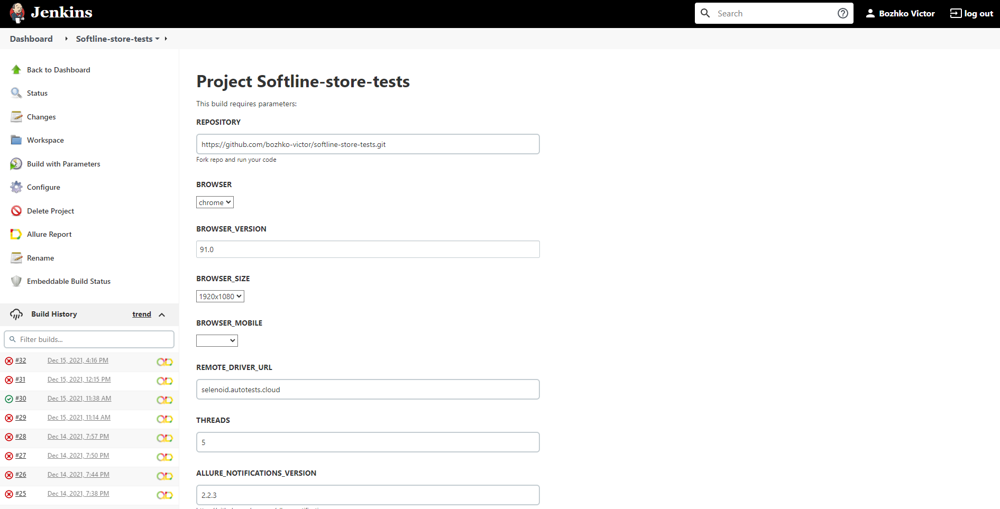
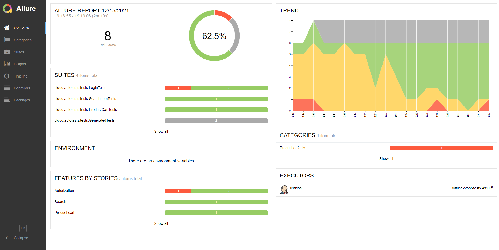
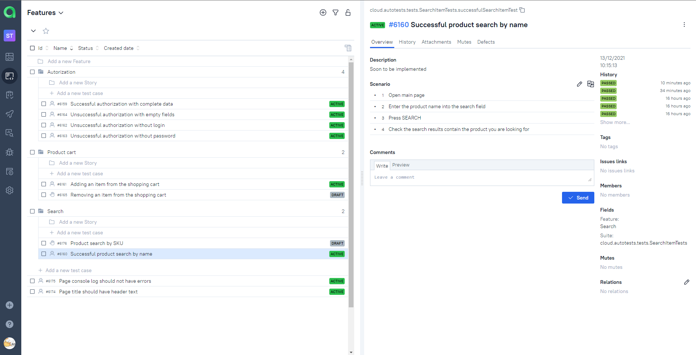
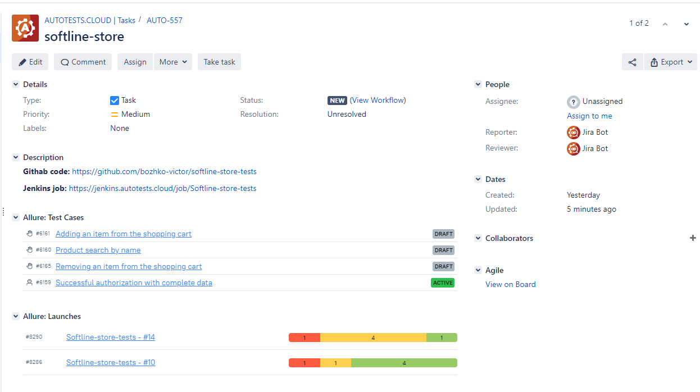
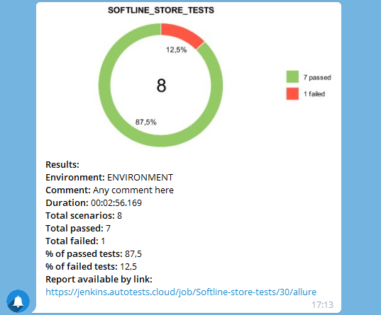

# Проект по автоматизации тестирования интернет-магазина


## Используемый стек технологий:


<p align="center">


  


</p>

## Автотестами покрыт следующий функционал:
* UI тесты
    * Проверки (позитивная и негативные) авторизации зарегистрированного пользователя
    * Проверка успешности добавления товара в корзину
    * Проверка поиска товара в каталоге по его наименованию
    * Проверка наличия заголовка страницы
    * Проверка на отсутствие ошибок в логах страницы 


## Параметры для запуска тестов

Запуск тестов локально:
```bash
gradle clean test
```

Запуск тестов без remote.properties:
```bash
gradle clean test
-Dbrowser={BROWSER}
-DbrowserVersion={BROWSER_VERSION}
-DbrowserSize={BROWSER_SIZE}
-DbrowserMobileView={BROWSER_MOBILE}
-DremoteDriverUrl=https://{login}:{password}@{REMOTE_DRIVER_URL}/wd/hub/
-DvideoStorage=https://{REMOTE_DRIVER_URL}/video/
-Dthreads={THREADS}
```

Ключи:
* Dbrowser - браузер, в котором будут выполняться тесты (по-умолчанию chrome)
* DbrowserVersion - версия браузера (по-умолчанию 91.0)
* DbrowserSize - разрешение окна браузера (по-умолчанию 1920x1080)
* DbrowserMobileView - формат устройства, на котором будут проводиться тесты
* DremoteDriverUrl - логин, пароль и адрес удаленного сервера, где будут выполняться тесты (по-умолчанию https://selenoid.autotests.cloud/wd/hub/)
* DvideoStorage - хранилище видео выполненных тестов (по-умолчанию https://selenoid.autotests.cloud/video/)
* Dthreads - количество параллельных потоков выполняющихся тестов (по-умолчанию 5)

Allure отчет:
```bash
allure serve build/allure-results
```

### Создание параметризованной сборки в Jenkins

<p align="center">
  
</p>


### Видео о прохождении тестов

### Отчёт о прохождении автотестов в Allure Report

<p align="center">
  
</p>

### Список автотестов в Allure Report

### Совместное управление ручным и автоматизированным тестированием в TMS Allure TestOps

<p align="center">
  
</p>

### Интерграция Allure TestOps с Jira

<p align="center">
  
</p>

### Уведомления о прохождении автотестов через Telegram бота

<p align="center">
  
</p>


### Автотесты можно запустить из Jenkins

<p align="center">
  
</p>


### Allure отчет о пройденных тестах можно посмотреть из Jenkins или через бота

<p align="center">
  
</p>

### Каждый отдельный тест можно посмотреть по шагам, присутствуют логи/видео/снапшот

<p align="center">
  
</p>

### Генерируется отчет и для Allure TestOps

<p align="center">
  
</p>

### Интеграция с Jira через Allure TestOps

<p align="center">
  
</p>

##  Как запускается тест в Selenoid

<p align="center">
  
</p>